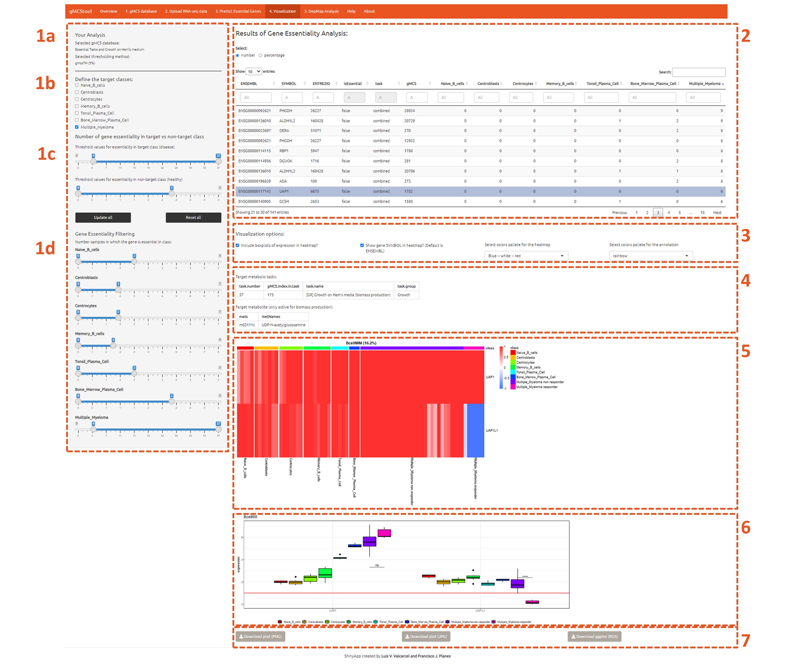
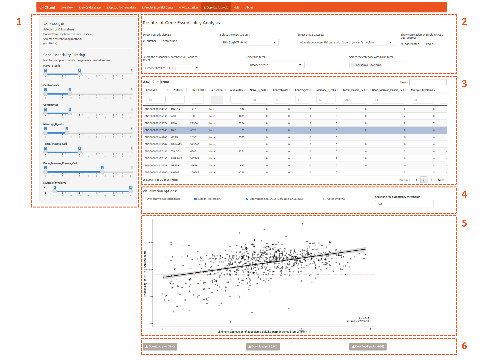

## Quick start

gMCStool outputs a list of predicted essential metabolic genes and their companion biomarkers for a given cohort of RNA-seq samples.
The functionalities of gMCStool are divided into 5 different modules. Figure 1 shows the gMCStool' pipeline:


<p style="text-align:center;"></p>

<br>

<b>1. 1.	Select gMCS database.</b> Selection of the database of gMCSs for the analysis. The user can select the metabolic tasks included in the analysis, as well as the growth medium constraints for the biomass task. Additionally, the user can examine the number gMCS associated with each task, download the entire set of selected gMCSs or generate summary figures. Note: the database of gMCSs were calculated from [Human-GEM-1.4.0](https://github.com/SysBioChalmers/Human-GEM).

<b>2. Upload the RNA-seq data.</b> In this module, RNA-seq data and metadata for the samples can be uploaded in different formats. It includes a summary table that allows the user to check the input data.

<b>3. Predict Essential Genes.</b> In this module, gene essentiality analysis for the given samples is performed using our gMCS approach. The user needs to specify the thresholding approach to calculate highly and lowly expressed (ON-OFF) genes. We provide two options: our own approach, gmcsTHX, in which the desired threshold value must be specified, or a previous approach in the literature, localT2, in which the user must decide to use the genes involved in the database of gMCSs or all the genes of Human1.

<b>4. Visualization.</b> This module is divided into two parts. In the left part, the user can filter genes according to its essentiality across the different sample classes analyzed. In the right part, the resulting essential genes and associated gMCSs are detailed. Selected pair gene-gMCS is plotted in a customizable heatmap and a boxplot which increase the interpretability of the results, providing information about possible biomarkers and functional explanation.

<b>5. DepMap Analysis.</b> The user can also visualize the association between the essentiality scores of predicted essential genes, available in the [DepMap database](https://depmap.org/portal/), and the summary expression of the partner genes involved in their associated gMCSs from [Cancer Cell Line Encyclopedia](https://sites.broadinstitute.org/ccle/). Users can select  different expression units and gene silencing approaches. Moreover, there are several filters that can be modified to select the subset of cell lines of interest.


<br>
<br>
<br>

## Guided example :

This is a tutorial to exemplify the use of gMCStool to perform gene essentiality analysis. For illustration, we analyze the metabolic dependencies of a dataset including different B cell subpopulations ([DepMap database](https://depmap.org/portal/)) and the MM samples ([DepMap database](https://depmap.org/portal/)).

<p style="text-align:center;"><iframe width="560" height="315" src="https://www.youtube.com/embed/k9OM2lhDHEU" title="YouTube video player" frameborder="0" allow="accelerometer; autoplay; clipboard-write; encrypted-media; gyroscope; picture-in-picture" allowfullscreen></iframe> </p> 
<br>

### Step 1: access the tool

We can access to the online version of gMCStool here: [link](https://biotecnun.unav.es/app/gmcstool).
We can also download gMCStool from [GitHub](https://github.com/lvalcarcel/gMCStool/). Once the Git repository is cloned, the Shiny app can be run locally simply by typing:

```{r eval=F, echo=T}

shiny::runApp('./app.R')

```

The code is prepared to adjust the amount of available RAM and number of cores. For large datasets we strongly encourage the use of gMCStool in a local computer rather than the online version.
For any of the 2 options, the user encounters this main presentation panel:


<p style="text-align:center;"></p>


There are two buttons:
<ul>
  <li><b>Start!</b>: gMCStool automatically selects the database of gMCSs and the user directed to the panel “Upload the RNA-seq data”.</li>
  <li><b>Go to gMCS database</b>: the user goes to the panel “gMCS database”.</li>
</ul>


### Step 2 (optional) select the gMCS database

This optional panel allows the user to modify the database of gMCSs. We recommend to proceed in the order shown in the image below:

<p style="text-align:center;"></p>
<ol>
  <li><b>Select the gMCS database</b>: here the user selects the metabolic tasks involved in the database of gMCSs: </i>all metabolic essential tasks</i>, only those related with biomass production (<i>only biomass production</i>) or <i>selected tasks</i> (see below). Moreover, the subset of gMCSs for biomass production can be derived from Ham’s growth medium (<i>Growth on Ham’s medium</i>), as  defined in Human1, or from an unconstrained medium including all possible input exchange fluxes from Human 1 (<i>Growth on unconstrained medium (all uptakes available)</i>).</li>
  <li><b>Select the metabolic task within the gMCS database</b>: if the user decides to custom the selection of gMCSs (<i>Selected tasks</i>), individual or groups of tasks can be eliminated or included through the selection tree.</li>
  <li><b>Summary table of the selected gMCS</b>: a table with selected metabolic essential tasks, their group from Human1 and their number of gMCSs.</li>
</ol>


### Step 3: Upload the RNA-seq data

<p style="text-align:center;"></p>

<ol>
  <li><b>Here you can upload the data</b>: here the user can select the method to update gene expression information. In particular, we have 3 options:</li>

  <ol type="a">
    <li><i>Text files</i>: gene expression is provided in a text file, in which the first column stores the genes in Ensemble ID and the rest of columns store their expression for the different samples, being the column name the ID of each sample. The text file can be *.txt, *.tsv, *.csv or any file that can be automatically read with <i>data.table::fread</i> in R. Optionally, the user can upload the sample metadata in another text file with contains three columns: sample ID (same as the column names in the gene expression file), sample class and sample cohort. This last column is optional and it is only used to study and visualize separately essential genes per cohort.</li>
    <li><i>Tximport files</i>: This option allows the user to load an RDS file with the direct output from <i>tximport</i>, a popular R package to read results from pseudo aligners, such as <i>Kallisto</i> or <i>Salmon</i>.</li>
    <li><i>Rdata from previous session</i>: this option allows the user to download the gene expression data and the metadata of the samples for future use. In particular, the user can load previous sessions, including gene expression data, metadata and final results.</li>
    <li>In this box, the user can finally click Show examples, which hides other input data options and shows the three example datasets:</li>
    <ul>
      <li>Example dataset of B-cell subpopulations (35 samples) and MM samples (37 samples), in TPM.</li>
      <li>Example dataset of B-cell subpopulations (35 samples) and MM samples (37 samples), in log2(TPM+1).</li>
      <li>The DepMap / CCLE dataset of 621 cell lines used in the main article.</li>
    </ul>
  </ol>
  <li><b>Data upload</b>: depending on the selected option in <b>step 3.1</b>, there will appear a different number of inputs. By clicking in the <i>“Browser…”</i> option, the user can select the desired file from the local PC.</li>
  <li><b>Summary table of the input data</b>: here two tables are shown. The first one summarizes the number of samples and their associated class. The second one summarizes the number of samples for each cohort. The 4 buttons allow the user to arrange the labels according to different criteria.</li>
  <li><b>Sample metadata</b>: here we have the complete information of all the samples. If there is no information for the cohort, it will be replaced by “---“. The table is automatically colored for easier inspection. Moreover, it is possible to manually change the values of the metadata. Manual changes are recommended to be saved by clicking the download buttons that are below this table.</li>
</ol>


### Step 4: Select parameters and run the Gene Essentiality Analysis (GEA)

<p style="text-align:center;"></p>


<table style="width:100%; border:0px solid black">
  <tr>
    <td width="40%">
    <p style="text-align:center;"></p>
    </td>
    <td width="60%">
    <ol>
      <li>Options for the gene essentiality analysis prediction:</li>
      <ol type="a">
        <li><b>Select the gMCS database</b>: Summarize the options selected in <b>Step 2</b>.</li>
        <li><b>Gene expression thresholding method</b>. The user can select <i>gmcsTHX</i> and quantile of expression threshold for X%, which is by default 5%; or <i>localT2</i>, where the user can select all genes in Human1 or all genes involved in the database of gMCSs.</li>
        <li><b>Calculate</b>. Click here to perform the gene essentiality analysis (GEA) using the gMCS approach. This is the most time-consuming step.
      </ol>
      <li><b>Load examples or previously calculated results</b>. In the figure above we clicked in the button <i>“Load Example results”</i> and all the examples included in the tool are shown:</li>
      <ul>
        <li>Example results of B-cell subpopulations and MM samples [TPM], <i>gmcsTH5</i>.</li>
        <li>Example results of B-cell subpopulations and MM samples [log2(TPM+1)], <i>gmcsTH5</i>.</li>
        <li>Example results of B-cell subpopulations and MM samples [TPM], <i>localT2.</i></li>
        <li>Example results of B-cell subpopulations and MM samples [log2(TPM+1)], <i>localT2.</i></li>
        <li>Results for the 621 cell lines of DepMap used in the main article with <i>gmcsTH5.</i></li>
      </ul>
    </ol>
  </tr>
</table>


<ol start="3">


  <li><b>Results of Gene Essentiality Analysis</b>. Here there is a summary table that shows the predicted percentage of samples for which a gene is predicted as essential. The user can change from percentages to number of samples. The columns are:</li>
  <ol>
    <li><i>ENSEMBL, SYMBOL, ENTREZID</i>: identifiers of the gene.</li>
    <li><i>isEssential</i>: this indicates whether this gene constitute a gMCSs of order 1 (essential for all samples).</li>
    <li><i>num.gMCS</i>: number of gMCS in which the gene is involved.</li>
    <li><i>NB, CB	, CC, MEM, TPC, BMPC, MM</i>: number/percentage of samples of Bcell subpopulations and MM in which this gene is considered essential.</li>
  </ol>
  <li><b>Saving the results</b>. there are three buttons to download the results.</li> 
  <ol type="a">
    <li><i>Download table</i>: download in a *.txt file the summary table in the <b>step 4.3</b>.</li>
    <li><i>Download Excel (all)</i>: Download an Excel file that contains the following information:</li>
    <ol type = "a">
      <li><b>single met tasks</b>:</li>
        <ol>
          <li><i>ENSEMBL, SYMBOL, ENTREZID</i>: identifiers of the gene.</li>
          <li><i>isEssential</i>: this indicates whether this gene constitute a gMCSs of order 1 (essential for all samples).</li>
          <li><i>num.gMCS</i>: number of gMCS in which the gene is involved.</li>
          <li><i>NB, CB	, CC, MEM, TPC, BMPC, MM</i>: number of samples of B-cell subpopulations and MM in which this gene is considered essential.</li>
        </ol>
      <li><b>ratio met tasks</b>:</li>
        <ol>
          <li><i>ENSEMBL, SYMBOL, ENTREZID</i>: identifiers of the gene.</li>
          <li><i>isEssential</i>: this indicates whether this gene constitute a gMCSs of order 1 (essential for all samples).</li>
          <li><i>num.gMCS</i>: number of gMCS in which the gene is involved.</li>
          <li><i>NB, CB	, CC, MEM, TPC, BMPC, MM</i>: percentage of samples of B-cell subpopulations and MM in which this gene is considered essential.</li>
        </ol>
      <li><b>gmcs single</b>:</li> 
        <ol>
          <li><i>ENSEMBL, SYMBOL, ENTREZID</i>: identifiers of the gene.</li>
          <li><i>isEssential</i>: this indicates whether this gene constitute a gMCSs of order 1 (essential for all samples).</li>
          <li><i>task</i>: name of the task in which it is involved. ‘combined’ means the set of all the gMCS combined for all tasks.</li>
          <li><i>gMCS</i>: ID of the gMCS.</li>
          <li><i>NB, CB	, CC, MEM, TPC, BMPC, MM</i>: percentage of samples of B-cell subpopulations and MM in which this gene is considered essential.</li>
        </ol>
      </ol>

  <li>Download Rdata. We highly recommend this one. This option allow the user to save an *.Rdata file in its computer, that can be loaded afterwards like indicated in Step 6.
All tables will be downloaded according to the sample class that is in the current study, with the names given by the user. Moreover, inside the Rdata file there is the variable ‘mat.essential.gene’, that store a binary matrix of genes by samples, which indicates for which samples each gene is considered as essential.</li>
</ol>


### Step 5: Visualize gMCSs

<p style="text-align:center;"></p>

<ol>

  <li>Options in the selection of predicted essential genes: </li> 
  <ol type="a">
    <li><b>Your analysis</b>. Summary of the options used in the gMCS approach.</li>
    <li><b>Define the target class</b>. Select the (disease) sample class we are interested in targeting. In this case, we selected Multiple Myeloma samples.</li> 
    <li><b>Percentage of gene essentiality in target vs non-target class</b>. Allowed essentiality percentage intervals for target class (here greater than 10%) and non-target class (here smaller than 2 samples). These values are automatically fixed in the filters below once we press update all or reset all.</li>
    <li><b>Gene essentiality filtering</b>. Here we can change one by one the filters fixed above for each of the sample classes in the study.</li> 
    </ol>

  <li><b>Results of gene essentiality analysis</b>. The summary table has been modified according to the filters fixed above. The options and information are the same as in the previous figure.  With a single click in of the rows, the essential gene and its associated gMCS are visualized using a heatmap of expression (see below <b>Step 5.5</b>). Here, we selected the essential gene <i>UAP1</i>, which is involved in the gMCS {<i>UAP1</i>, <i>UAP1L1</i>}.
  <li><b>Visualization options</b>:
  <ol type="a">
    <li><i>Include boxplot of expression in heatmap?</i>: checkbox to display or not an expression boxplot for genes implied in the gMCS (see below in step 5.6).</li> 
    <li><i>Show gene SYMBOL in Heapmap?</i>: checkbox to display SYMBOL or ENSEMBL ID. By default, we have ENSEMBL ID.</li> 
    <li><i>Select colors palette for heatmap</i>:  In the ‘gene’ mode, color the dot by the gMCS which explains essentiality (the one with minimum expression of maximum expressed partner).</li> 
    <li><i>Show line for essentiality threshold</i>: draw an auxiliary line to visualize essentiality.</li>  
  </ol>
  <li><b>Target metabolic task</b>: the first table indicates the metabolic tasks associated for the gMCS that is visualized, and, in the case this task is the biomass production, the second table indicate the metabolite of the biomass that is blocked by it.</li> 
  <li><b>Expression Heatmap</b>: columns are samples and row are genes involved in the gMCS of interest. Color intensity for each gene and sample is the log2 gene expression relative to the sample expression threshold (<i>gMCSTH5</i> in this case). Target classes are divided in two sections, according to the samples that are predicted or not as essential (<i>Multiple_Myeloma_non responders</i> and <i>Multiple_Myeloma_responders</i>). Separate heatmaps are done for each cohort of samples.</li> 

</ol>


### Step 6: Examine correlation with DepMap data

Finally, the user can inspect the resulting gMCS to see if there is a correlation with the DepMap database:

<p style="text-align:center;"></p>

<ol>
  <li><b>Gene Essentiality Filtering</b>. Analogously to the analysis conducted in the previous step, we can filter the subset of essential genes to be analyzed. (<b>Step 5.1.d</b>) </li>
  <li><b>Essentiality database options</b>: </li>
  <ol type="a">
    <li><i>Select numeric display</i>: the same as in the previous steps.</li>
    <li><i>Select the RNA-seq unit</i>: select the expression unit for involved genes. The options are: log2(TPM+1), z-scores (TPM) or z-scores (log2(TPM)+1).</li>
    <li><i>Summary table by single or aggregated gMCSs</i>: By default we provide the summary table by single gMCS as in Step 8. Aggregating gMCSs for each essential gene implies identifying the most limiting partner gene for each sample across all gMCSs. This is done by extracting the minimum expression over the maximum expressed partner gene for each gMCS. This second option provides the correlation with DepMap data (rho) and its associated p-value (p.value and adjusted p.value).</li>
    <li><i>Select the essentiality database you want to select</i>: The use can choose the different datasets available in DepMap 21Q2.</li>
    <li><i>Select filter: the user can select the between the following categories</i>: none (default), primary disease, subtype or lineage.</li>
    <li><i>Select category within the filter</i>: This is a multiple selection panel that is activated whenever a filter category is selected.</li>
  </ol>
  <li><b>Results of gene essentiality analysis</b>. The summary table has been modified according to the filters fixed above. The options and information are the same as in the previous figure.  With a single click in of the rows, a correlation plot is generated.</li>
  <li><b>Options for the generated image</b>:</li>
  <ol type="a">
    <li><i>Only show selected in filter</i>: checkbox to discard filtered cell lines.</li>
    <li><i>Linear Regression?</i>: checkbox to plot the linear regression line.</li>
    <li><i>Show gene SYMBOL?</i>: checkbox to display SYMBOL or ENSEMBL ID..</li>
    <li><i>Color by gMCS?</i>: In the ‘gene’ mode, color the dot by the gMCS which explains essentiality (the one with minimum expression of maximum expressed partner).</li>
    <li><i>Show line for essentiality threshold</i>: draw an auxiliary line to visualize essentiality.</li>
  </ol>
  <li><b>Correlation plot</b>: each dot is a cell line, the y-axis represents the DepMap essentiality score, being the more negative, the more essential. The x-axis represents the summary expression of the aggregated gMCSs.</li>
  <li><b>Save the resulting plot</b>. Options are: *.png, *.jpeg or a *.rds, which contains a ggplot object that can be modified in R (advanced users).</li>


