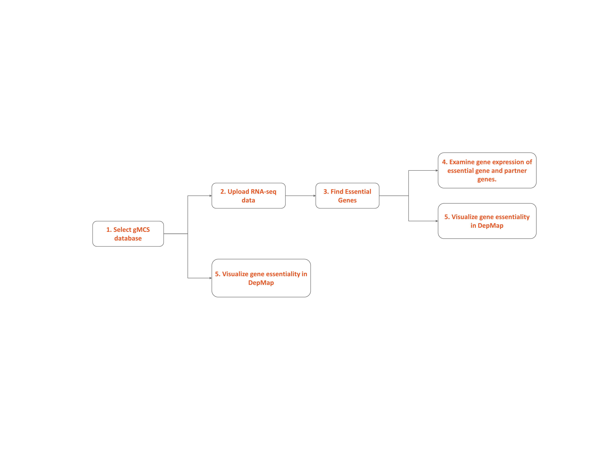
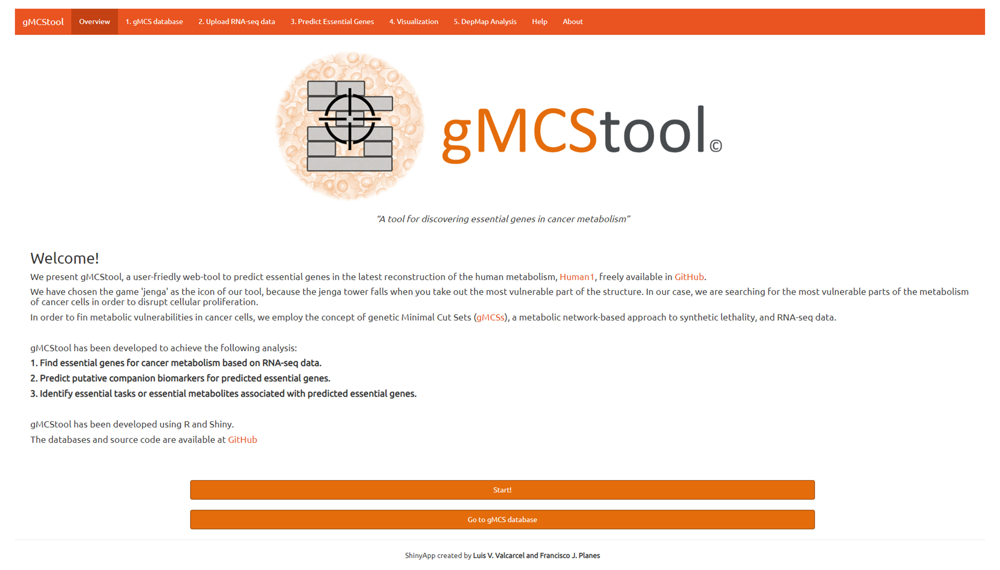
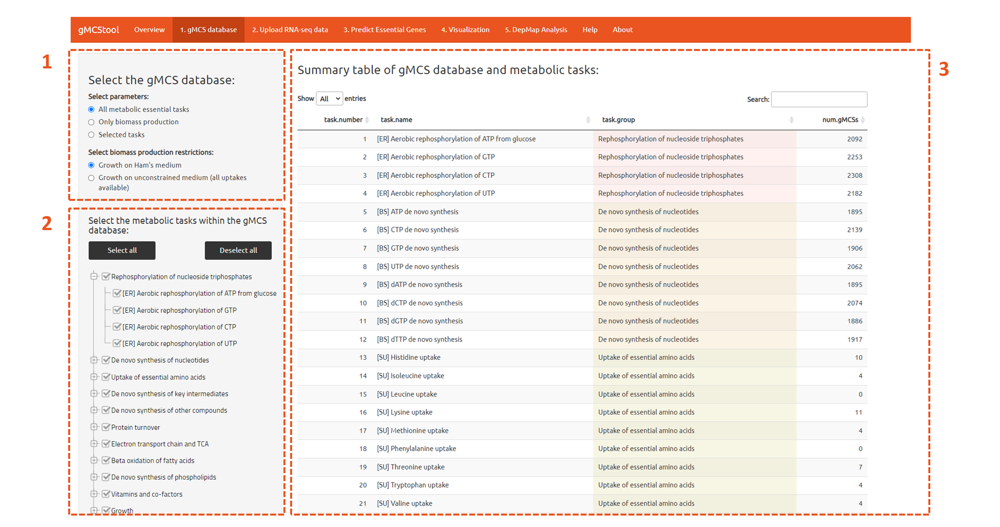
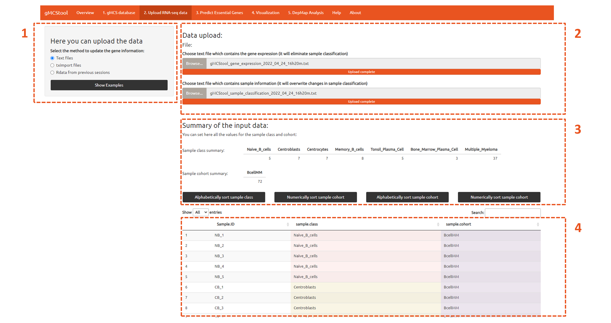
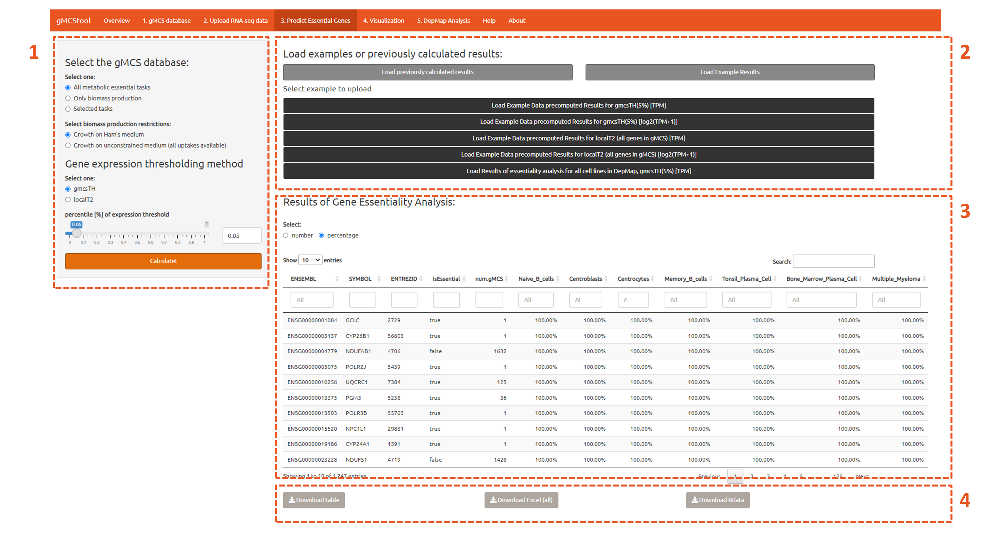
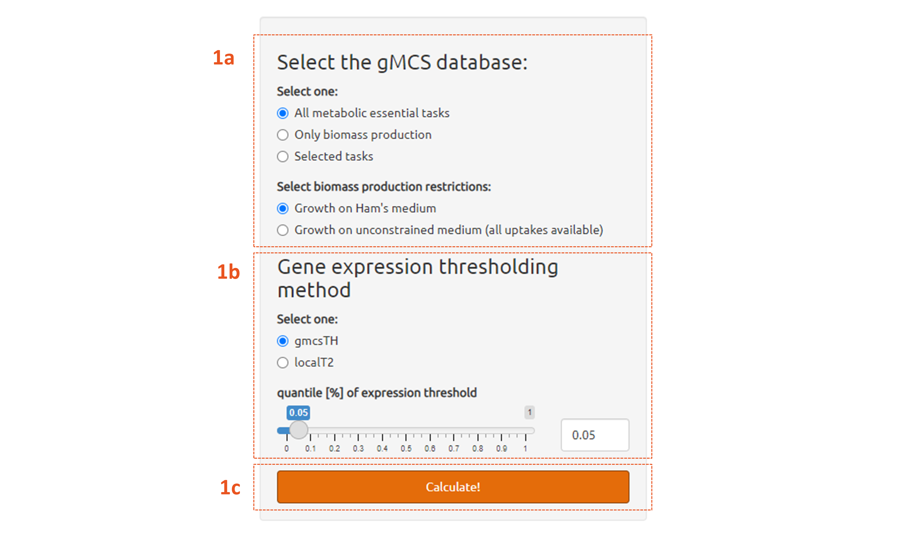
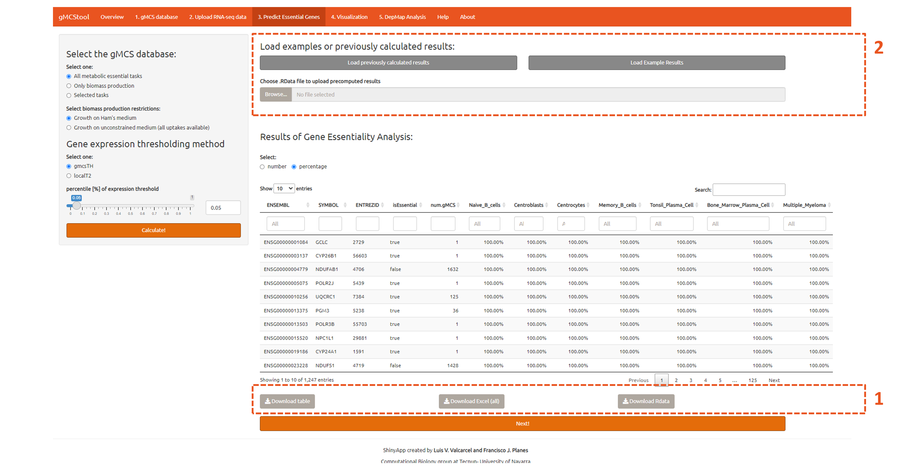

## Quick start

gMCStool outputs a list of predicted essential metabolic genes and their companion biomarkers for a given cohort of samples.
The functionalities of gMCStool are presented in a set of panels in the app. Figure 1 shows the gMCStool' pipeline:

<p style="text-align:center;"></p>

<br>

**1. gMCS database.** Selection of the gMCSs that the user wants to use for the analysis, all of them calculated for Human-GEM-1.4.0. The user can select the metabolic tasks included in the analysis, as well as the constraints for the biomass task. Additionally, the user can examine the number gMCS that are within each task, download the entire set of selected gMCSs or generate summary figures.

**2. Upload the RNA-seq data.** gMCStool is able to load RNA-seq information and metadata for the samples in different formats. It also generates a summary table to check the input data.

**3. Predict Essential Genes.** gMCStool performs a gene essentiality analysis for the given samples. The user can define the thresholding approach to calculate ON-OFF genes and calculate essential genes using the gMCS approach: the options are gmcsTH, in which the user can select the desired value of the threshold, or localT2, in which the user can decide to use the genes of the gMCSs or all the genes of Human1

**4. Visualization.** This panel is divided in two parts. In the left part the user can filter genes according to its essentiality along the different sample classes. In the right part, the resulting genes are explored in its different gMCSs which explain its essentiality. Selected pair gene-gMCS is plotted in a customizable heatmap and a boxplot which increase the interpretability of the results, providing information about possible biomarkers and functional explanation.

**5. DepMap Analysis.** The user can also visualize the essentiality of any gene and gMCS in the DepMap database, different units for the genes and different essentiality databases. Moreover, there are several filters that the user can select to select only a fraction of the cell lines.


<br>
<br>
<br>

## Guided example :

<iframe width="560" height="315" src="https://www.youtube.com/embed/k9OM2lhDHEU" title="YouTube video player" frameborder="0" allow="accelerometer; autoplay; clipboard-write; encrypted-media; gyroscope; picture-in-picture" allowfullscreen></iframe>
<br>

### Step 1: access the tool

To use the tool there are several options: The first one is to use the online version of the [tool](https://biotecnun.unav.es/app/gmcstool), or it can be downloaded from [GitHub](https://github.com/lvalcarcel/gMCStool/). Once the git repository is cloned, the shiny app can be run locally simply by typing:


```{r eval=F, echo=T}

shiny::runApp('./app.R')

```

The code is prepared to adjust the amount of available RAM and number of cores, based on the information of the PC. Furthermore, there are two variables to activate real-time tables in the tabs 4 and 5. For large datasets we strongly encourage the use of the tool in a computer, rather than the online version.
#### Any of the chosen options, the user encounters this main presentation panel:


<p style="text-align:center;"></p>

There are two buttons:
 - Start!: automatically selects the database of gMCSs used in this work.
 - Go to gMCS database: the user goes to the next step.


### Step 2 (optimal) select the desired database

This optional panel allows the user to modify the database of gMCSs used by the tool. Use in the order in which appear in the image:

<p style="text-align:center;"></p>
<ol>
  <li>Select the gMCS database: here the user can select to use all metabolic tasks, only the proliferation or the custom selection of gMCSs, in which only a subset of tasks can be selected. Moreover, the biomass production can be constraint with Ham’s growth medium (like in the original definition of the metabolic tasks) or without limitations in the input metabolites to the model (all possible in the definition of Human1).</li>
  <li>Custom selection of gMCS: if the user only wants a subset of gMCSs, the selection tree allows to eliminate or select individual tasks or groups of tasks.</li>
  <li>Summary table of the selected gMCS: selected tasks and group to which it belongs, there is also the number of gMCS that are in this task.</li>
</ol>

### Step 3: upload the data for the analysis

<p style="text-align:center;"></p>

1.	Select the gMCS database: here the user can select to use all metabolic tasks, only the proliferation or the custom selection of gMCSs, in which only a subset of tasks can be selected. Moreover, the biomass production can be constraint with Ham’s growth medium (like in the original definition of the metabolic tasks) or without limitations in the input metabolites to the model (all possible in the definition of Human1).
  <ol type="a">
    <li>Text files: gene expression is provided in a text file, in which the first columns are the genes in ENSEMBL ID and the rest of columns are for the samples, being the column name the ID of each sample. The text file can be a *.txt, *.tsv, *.csv or any file that can be automatically read with data.table::fread. Optionally, the user can upload the sample metadata in another text file with contains three columns: sample ID (same as the column names in the gene expression), sample class and sample cohort. This last column is optional and it is only used to generate different heatmaps and to calculate different localT2 thresholds.</li>
    <li>Tximport files: This option allows the user to load an RDS file with the direct output of using tximport, a popular R package to read results from pseudo aligners, such as Kallisto or Salmon.</li>
    <li>Rdata from previous session: In the bottom part of the tab there is an option to download the gene expression and the metadata of the samples for future use. With that option, the user can load the previous sessions. Moreover, the user can upload here final results, to only load the gene expression and the metadata.</li>
    <li>Show examples: This option hides the other input options and shows the three example datasets:</li>
    <ul>
      <li>Example dataset of B-cell subpopulations (35 samples) and MM samples (37 samples), in TPM.</li>
      <li>Example dataset of B-cell subpopulations (35 samples) and MM samples (37 samples), in log2(TPM+1).</li>
      <li>The DepMap / CCLE dataset of 621 cell lines used in the main article.</li>
    </ul>
  </ol>
2.	Selection of files: depending on the selected option in step 3.1, there will appear a different number of inputs. By clicking in the “Browser…” option, the user can select the desired file from the PC.
3.	Summary table of the uploaded sample class: Here there will be two tables. The first one is a summary of the number of samples which belong to each class. The second one is a summary of the number of samples which belong to each cohort .The buttons allow to arrange the labels according to different criteria.
4.	Sample metadata: Here there is a table with the complete information of all the samples. If there is no information for the cohort, it will be replaced by “---“. The table is automatically colored for easier inspection. Moreover, it is possible to manually change the values of the metadata. Manual changes are recommended to be saved clicking the download buttons that are below this table.


### Step 4: Select parameters and run the Gene Essentiality Analysis (GEA)

<p style="text-align:center;"></p>

1.	Select the gMCS parameters for the gene essentiality analysis calculation: 
<p style="text-align:center;"></p>
  <ol type="a">
    <li>gMCS database: Same options as in Step 2, and the options are sync.</li>
    <li>Gene expression thresholding method. Default is gmcsTH.</li>
    <li>Set quantile for gmcsTH. Default is 5%.</li>
    <li>Click here to perform the gene essentiality analysis (GEA) using the gMCS approach. This is the most</li>
    time-consuming step.
  </ol>
2.	Upload previously calculated results or load examples.
3.	Panel depending on the previous selection. In this figure we show all the examples included in the tool:
  <ul>
    <li>Example results of B-cell subpopulations and MM samples [TPM], gmcsTH5.</li>
    <li>Example results of B-cell subpopulations and MM samples [log2(TPM+1)], gmcsTH5.</li>
    <li>Example results of B-cell subpopulations and MM samples [TPM], localT2.</li>
    <li>Example results of B-cell subpopulations and MM samples [log2(TPM+1)], localT2.</li>
    <li>Results for the 621 cell lines of DepMap used in the main article with gmcsTH5.</li> 
  </ul>
4.	Summary results: Here there is a summary table that shows the predicted number / percentage of samples for which any gene is predicted as essential. The user can change the visualization into numeric or percentage. The columns are:
    1.	ENSEMBL, SYMBOL, ENTREZID: identifiers of the gene.
    2.	isEssential: indicates whenever the gene is essential by the definition of the GEM. This indicates that this gene belongs to a gMCSs of order 1.
    3.	num.gMCS: number of gMCS in which the gene is involved.
    4.	NB, CB	, CC, MEM, TPC, BMPC, MM: number/percentage of samples of Bcell subpopulations and MM in which this gene is considered essential.


### Step 5: Save the results

<p style="text-align:center;"></p>

There are three buttons to download the results. 
<ol>
  <li>Download table: download in a *.txt file the results that are in the table adobe these buttons.</li>
  <li>Download Excel (all): Download an Excel file with contains the following information:</li>
    <ol type = "a">
      <li>single met tasks:</li>
        <ol>
          <li>ENSEMBL, SYMBOL, ENTREZID: identifiers of the gene.</li>
          <li>isEssential: indicates whenever the gene is essential by the definition of the GEM. This indicates that this gene belongs to a gMCSs of order 1.</li>
          <li>num.gMCS: number of gMCS in which the gene is involved.</li>
          <li>NB, CB	, CC, MEM, TPC, BMPC, MM: number of samples of Bcell subpopulations and MM in which this gene is considered essential.</li>
        </ol>
      <li>ratio met tasks:</li>
        <ol>
          <li>ENSEMBL, SYMBOL, ENTREZID: identifiers of the gene.</li>
          <li>isEssential: indicates whenever the gene is essential by the definition of the GEM. This indicates that this gene belongs to a gMCSs of order 1.</li>
          <li>num.gMCS: number of gMCS in which the gene is involved.</li>
          <li>NB, CB	, CC, MEM, TPC, BMPC: percentage of samples of Bcell subpopulations and MM in which this gene is considered essential.</li>
        </ol>
      <li>gmcs single:</li> 
        <ol>
          <li>ENSEMBL, SYMBOL, ENTREZID: identifiers of the gene.</li>
          <li>isEssential: indicates whenever the gene is essential by the definition of the GEM. This indicates that this gene belongs to a gMCSs of order 1.</li>
          <li>task: tame of the task in which it is involved. ‘all_57_met_task_combined’ means the set of all the gMCS combined for all tasks.</li>
          <li>gMCS: ID of the gMCS.</li>
          <li>NB, CB	, CC, MEM, TPC, BMPC: percentage of samples of Bcell subpopulations and MM in which this gene is considered essential.</li>
        </ol>
      </ol>

  <li>Download Rdata. We highly recommend this one. This option allow the user to save an *.Rdata file in its computer, that can be loaded afterwards like indicated in Step 6.
All tables will be downloaded according to the sample class that is in the current study, with the names given by the user. Moreover, inside the Rdata file there is the variable ‘mat.essential.gene’, that store a binary matrix of genes by samples, which indicates for which samples each gene is considered as essential.</li>
</ol>

### Step 6 (optional): Load previously calculated results
 
<p style="text-align:center;"></p>

It is possible to load previous studies in the app, to avoid the time-consuming step of performing the GEA. To do so, in the third panel ( 3.Predict Essential Genes), the user can select ‘Load previously calculated results’ and then clicking ‘Browse…’. This will show an explorer to select a *.Rdata file with previously saved results, loading in addition all the sample metadata and the gene expression.


### Step 7: Filter results based on sample classes
<p style="text-align:center;"></p>

1.	Select the gMCS parameters for the gene essentiality analysis calculation: 
  <ol type="a">
    <li>Summary of the methods used up to this moment.</li>
    <li>Definition of target and non-target classes. Target classes must be selected and are given more insight in the heatmap and the boxplot.</li>
    <li>Define global filters that are defined to all samples according to the categorization of target and non-target classes. The buttons allow to overwrite all filters with these values or to reset all of them.</li>
    <li>Filters for each of the sample classes in the study.</li>
  </ol>


### Step 8: Visualize gMCSs

<ol start="2">
  <li>Table with results of essentiality by gene and gMCS pairs, summarizing the essentiality by the number or percentage of samples predicted as essential in each of the sample classes.	Moreover, the user can select if the gene essentiality is shown in number of samples or in percentage. The columns are:</li>
  <ol type="a">
    <li>*ENSEMBL, SYMBOL, ENTREZID:* identifiers of the gene.</li>
    <li>*isEssential:* indicates whenever the gene is essential by the definition of the GEM. This indicates that this gene belongs to a gMCSs of order 1.</li>
    <li>*task:* tame of the task in which it is involved. ‘all_57_met_task_combined’ means the set of all the gMCS combined for all tasks.</li>
    <li>*gMCS:* ID of the gMCS.</li>
    <li>*NB, CB	, CC, MEM, TPC, BMPC, MM:* number/percentage of samples of Bcell subpopulations and MM in which this gene is considered essential.</li>
  </ol>  
  <li>Options for the generated image:</li>
  <ol type="a">
    <li>Include boxplot of expression in heatmap? Checkbox to display or not the boxplot of Step 8.6.</li>
    <li>Show gene SYMBOL in Heapmap?: Checkbox to display SYMBOL or ENSEMBL ID.</li>
    <li>Color by gMCS?:. In the ‘gene’ mode, color the dot by the gMCS which explains essentiality (the one with minimum expression of maximum expressed partner).</li>
    <li>Show line for essentiality threshold: draw an auxiliary line to visualize essentiality.</li>
  </ol>  
  <li>Analysis of the selected gMCS: first table indicates the metabolic tasks that are targeted by the gMCS, and the second table indicate the metabolite of the biomass that is blocked by it.</li>
  <li>Heatmap: the gene expression relative to the expression threshold is plotted in log2. Positive means over the threshold negative below the threshold. Target classes are divided in two sections and displayed the percentage of samples that are predicted as essential. Separate heatmaps are done for each cohort of samples.</li>
  <li>Boxplot: the same results are plotted in absolute expression, in the x-axis distributed by gene and colored by sample class. A t-test is performed between the two populations of the target classes, the non-responders and the responders.</li>
  <li>Save the resulting plot. Options are a *.png, *.jpeg or a *.rds, which contains a ggplot object that can be modified in R (advanced users).</li>
</ol>


### Step 9: Examine correlation with DepMap data

Finally, the user can inspect the resulting gMCS to see if there is a correlation in the DepMap database:
<p style="text-align:center;"></p>

<ol>
  <li>These are filters at gene level, sync with the ones in the step 7. They can be used to focus only in genes of interest.</li>
  <li>Options to show the table and to obtain the desired results:</li>
  <ol type="a">
    <li>Select numeric display: same as in Step 8, the user can select if the gene essentiality is shown in number of samples or in percentage.</li>
    <li>Select the RNA-seq unit: select the unit for the partner genes. The options are log2(TPM+1), z-scores (TPM) or z-scores (log2(TPM)+1).</li>
    <li>Select gMCS dataset: The user can select the desired gmcs database (custom gMCS database is not included at this point).</li>
    <li>Show correlation by gene or gMCS: Table by gMCS is the same that in Step 8. By gene the correlation is calculated by the minimum of all the maximum expressed partner gene by each gMCS. The gene option provides the correlation and the p-values in the table.</li>
    <li>Select the essentiality database you want to select: There are several datasets available in DepMap 21Q2.</li>
    <li>Select the filter: select the between the following categories: none (default), primary disease, subtype or lineage.</li>
    <li>Select the category within the filter: This is a multiple selection panel that shows the posibilities within the selected category.</li>
  </ol>
  <li>Table with results of essentiality by gene with the correlation in the ‘gene’ mode, or with essentiality by gene and gMCS in the ‘gmcs’ mode. The columns are:</li>
  <ol type="a">
    <li>ENSEMBL, SYMBOL, ENTREZID: identifiers of the gene.</li>
    <li>isEssential: indicates whenever the gene is essential by the definition of the GEM. This indicates that this gene belongs to a gMCSs of order 1.</li>
    <li>num.gMCS: number of gMCS in which the gene is involved.</li>
    <li>NB, CB	, CC, MEM, TPC, BMPC, MM: number/percentage of samples of Bcell subpopulations and MM in which this gene is considered essential.</li>
    <li>rho: correlation between maximum expressed partner gene and essentiality.</li>
    <li>p.value, p.adj: p-value of previous correlation, and the adjusted p-value. </li>
  </ol>
  <li>Options for the generated image:</li>
  <ol type="a">
    <li>Only show selected in filter: filter cell lines and only plot those selected.</li>
    <li>Linear Regression?: Checkbox to plot the linear regression line.</li>
    <li>Show gene SYMBOL?: Checkbox to display SYMBOL or ENSEMBL ID.</li>
    <li>Color by gMCS?:. In the ‘gene’ mode, color the dot by the gMCS which explains essentiality (the one with minimum expression of maximum expressed partner).</li>
    <li>Show line for essentiality threshold: draw an auxiliary line to visualize essentiality.</li>
  </ol>
  <li>Correlation plot: each dot is a cell line, the y-axis represents the essentiality, the more negative, the more essential. The x-axis represents the expression of the maximum expressed partner gene.</li>
  <li>Save the resulting plot. Options are a *.png, *.jpeg or a *.rds, which contains a ggplot object that can be modified in R (advanced users).</li>


